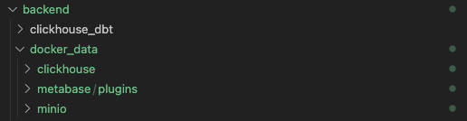

# fungjai

## Local Deploy Backend

### ขั้นเตรียม

1. สร้าง python environment โดยรันคำสั่ง

``` sh
    python3 -m venv ENV
```

2. activate python environment

``` sh
    source ENV/bin/activate
```

3. ทำการติดตั้ง packages โดยรันคำสั่ง

``` sh
    pip install -r requirements.txt
```

4. ติดตั้ง docker compose สามารถศึกษาขั้นตอนได้จาก ที่นี่ >> https://docs.docker.com/get-docker/

### Deploy

1. run command

``` sh
    docker-compose up -d
```

**หลังรันคำสั่ง จะได้ 3 containers** 

- clickhouse (sql database)

- minio (bucket storage)

- metabase (visualize tool)

### วิธีเช็คว่าทุกอย่างทำงานได้ถูกต้อง

- สามารถเปิด minio ui ได้ที่

```
http://localhost:9001/
```

- สามารถเปิด clickhouse ui ได้ที่

```
http://localhost:8123/play
```

- สามารถเปิด metabase ui ได้ที่

```
http://localhost:3000/setup
```
### Docker Data
เพื่อความสะดวกในการเข้าถึง table ใน clickhouse และการเข้าถึง file ใน minio bucket ได้ทำการ mount volume ของ docker container ไว้ที่ local ดังด้านล่าง

``` yml
      volumes:
        - ./docker_data/clickhouse/server:/var/lib/clickhouse
        
```

ซึ่งจะอยู่ภายใน folder docker_data/ ดังด้านล่าง



**หากเริ่ม docker compose แล้ว clickhouse container ไม่ทำงาน ให้ comment บรรทัดตามรูปด้านล่าง แล้วสั่ง dokcer compose up -d อีกครั้ง**

``` yml
volumes:
      - ./docker_data/clickhouse/server:/var/lib/clickhouse
      # - ./init.sql:/docker-entrypoint-initdb.d/init.sql

```

**หากต้องการเริ่ม docker container โดยละทิ้งค่าที่เคยตั้งค่าไว้ทั้งหมด** ให้ลบ

- docker_data/clickhouse

- docker_data/minio/.minio.sys

## DBT Deploy
1. เข้าไปใน folder clickhose_dbt/

1. run command เพื่อเช็คว่าสามารถ connect ไปยัง clickhouse ได้

``` sh
   dbt debug
```

3. run command เพื่อทำงานตามการแก้ไขใหม่

``` sh
   dbt run
```

## Metabase Dashboard Setup
1. เข้าไปที่ http://localhost:3000/setup

1. กรอกข้อมูลให้ครบถ้วน ในส่วน Add your data ให้กด I'll add my data later


3. กด Finsih และ Take me to Metabase


4. ไปที่มุมขวาบน กดรูปฟันเฟือง แล้วเลือก Admin setting


5. กดเลือก Add a database


6. ใส่ configuration ตามรูปด้านล่าง แล้วกด Save


> Database type => ชนิด database ในที่นี้คือ ClickHouse

> Database Name => ชื่อ database ใน ClickHouse 
หากตอนสร้างไม่ได้เลือก database ใด ให้ใส่เป็น default

> Host => IP หรือ Domain ของ database ในที่นี้คือ clickhouse-server

> Username / Password => ผู้ใช้และรหัสผ่านเพื่อเข้าถึง database ในที่นี้คือ Username = default และเว้นช่อง Password